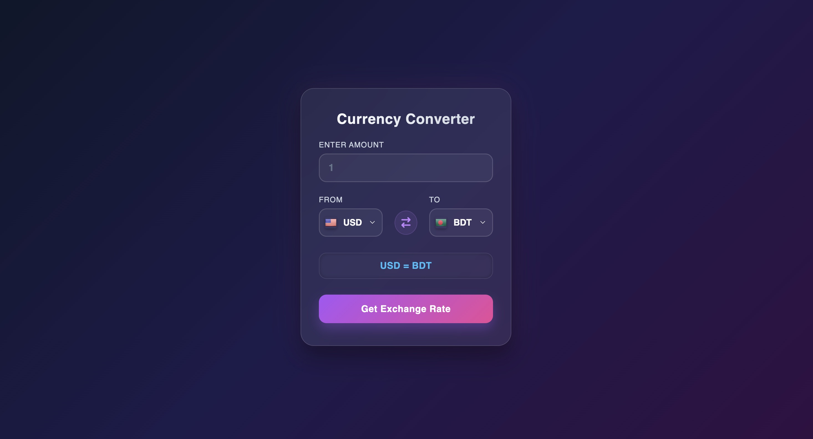

# Currency Converter

A simple and responsive Currency Converter built with HTML, CSS, and Vanilla JavaScript.

This project uses a currency API to get exchange rates and convert an amount from one currency to another in real time.

## 🌐 Live Demo

- **Live Link:** [Live-Demo](https://tonmoyislam-deventest.github.io/currency-converter/)

## 📸 Preview

## ✨ Features

- **Real-Time Currency Conversion:** Converts currencies using exchange rates from an API.
- **Dynamic Currency Selection:** Users can select both the base and target currencies.
- **Dynamic Flags:** The country flag changes automatically when a currency is selected.
- **Live Result:** Shows the converted amount after submitting the form.
- **Input Validation:** Prevents empty, invalid, or zero amounts.
- **API Error Handling:** Handles common errors such as `404`, `429`, and other request failures.
- **Responsive Design:** Works across desktop, tablet, and mobile devices.
- **Modern UI:** Uses gradients, glassmorphism, shadows, and smooth hover effects.

## 🧠 Key Functionality

The project follows a simple flow:

`User Input → API Request → JSON Response → Exchange Rate → Calculation → UI Update`

- Gets the selected base currency from the dropdown.
- Fetches exchange rate data from the Currency API.
- Finds the target currency rate from the API response.
- Multiplies the input amount by the exchange rate.
- Displays the converted result dynamically on the page.
- Updates the currency flag based on the selected currency.

## 🛠️ Technologies Used

- **HTML5:** For the structure of the application.
- **CSS3:** For styling, gradients, glassmorphism, animations, and responsive design.
- **Vanilla JavaScript:** For DOM manipulation, API requests, form validation, and conversion logic.
- **Currency API:** For fetching currency exchange rate data.
- **Flags API:** For displaying currency-related country flags.

## 💡 What I Learned

### JavaScript & API

- How to fetch data from an external API using `fetch()`.
- How to understand and access nested JSON data.
- How to get the required exchange rate from an API response.
- How dynamic base and target currencies can work with the same conversion logic.
- How exchange rates are used in currency conversion.
- How to handle API errors using HTTP status codes.
- How to update the DOM dynamically based on user selections.

## 🐛 Challenges & Solutions

### Understanding the API Response

One of the main challenges was understanding the API response structure and finding the correct exchange rate for the selected target currency.

**Solution:**  
I learned how to access the base currency object and then use the target currency code to get the required exchange rate.

### Dynamic Conversion Logic

Another challenge was handling different base and target currencies with the same conversion logic.

**Solution:**  
I used the selected currency codes dynamically, so the same calculation works for different currency combinations.

### Understanding Exchange Rates

At first, it was confusing to understand what the API's exchange rate actually represents.

**Solution:**  
I learned that the rate represents the value of the target currency for one unit of the selected base currency.

### DOM & `parentElement`

Finding the correct flag image when a currency was selected was another small challenge.

**Solution:**  
I used `parentElement` and `querySelector()` to find the existing image element and update its `src` dynamically.

### API Error Handling

Handling failed API requests was also part of the challenge.

**Solution:**  
I added checks for `response.ok` and handled common HTTP errors such as `404` and `429`, along with other request errors.

## 📬 Contact

- **GitHub:** [GitHub-Profile](https://github.com/tonmoyislam-deventest)
- **LinkedIn:** [LinkedIn-Profile](https://www.linkedin.com/in/tonmoy-islam12/)